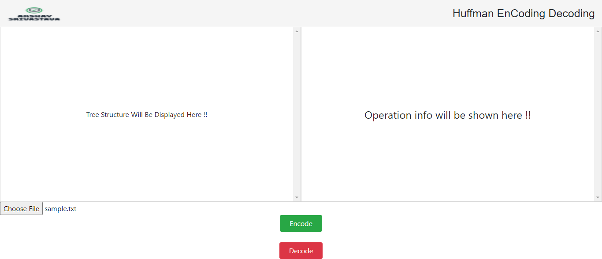
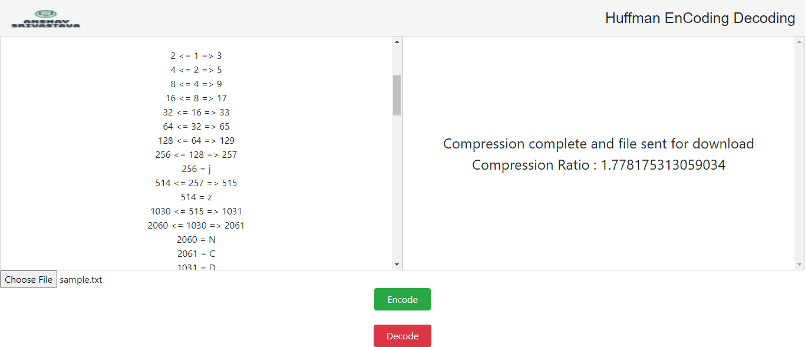
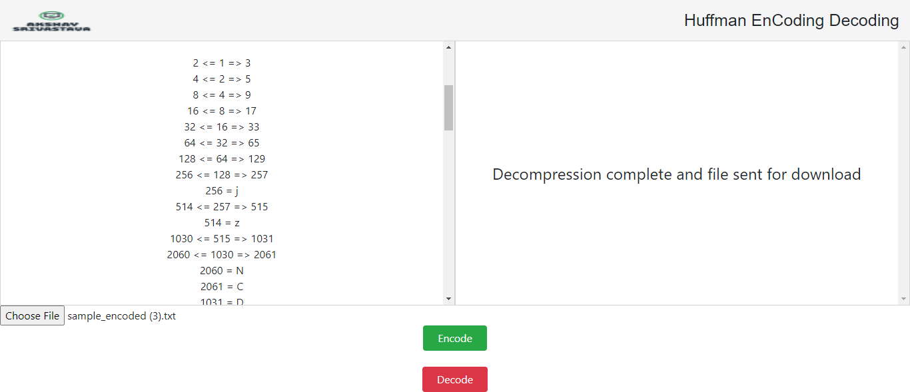

# File Zipper implemented Using  Huffman Encoding algorithm
Huffman
# AKshay Srivastava

## Preview

  

### Choose a Txt File For Encoding

  

### Click On Encode to encode the txt file

  

### Now to have the decoded file choose a encoded file and click on decode button on screen

  

